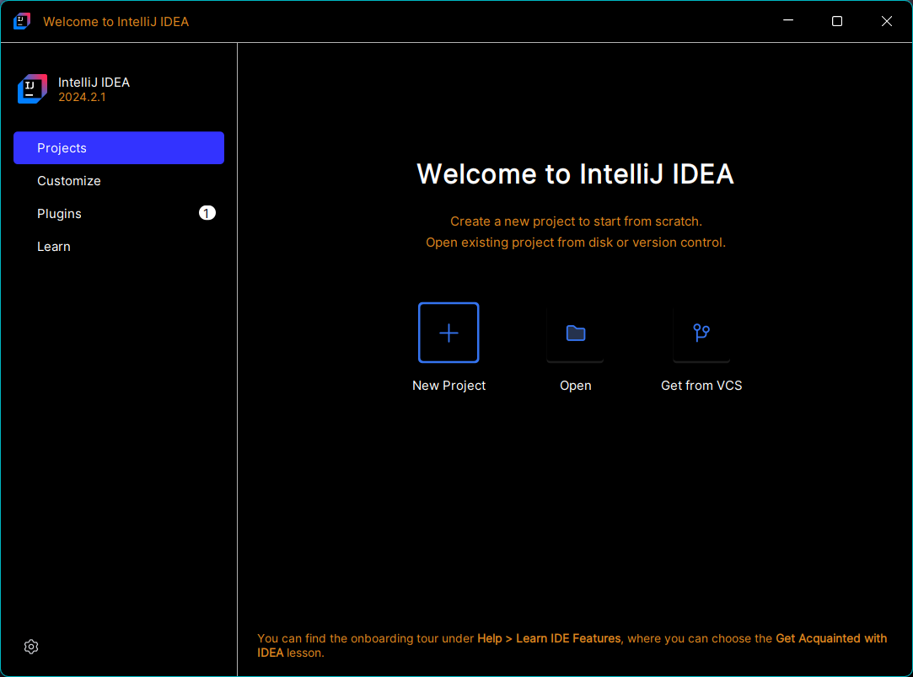
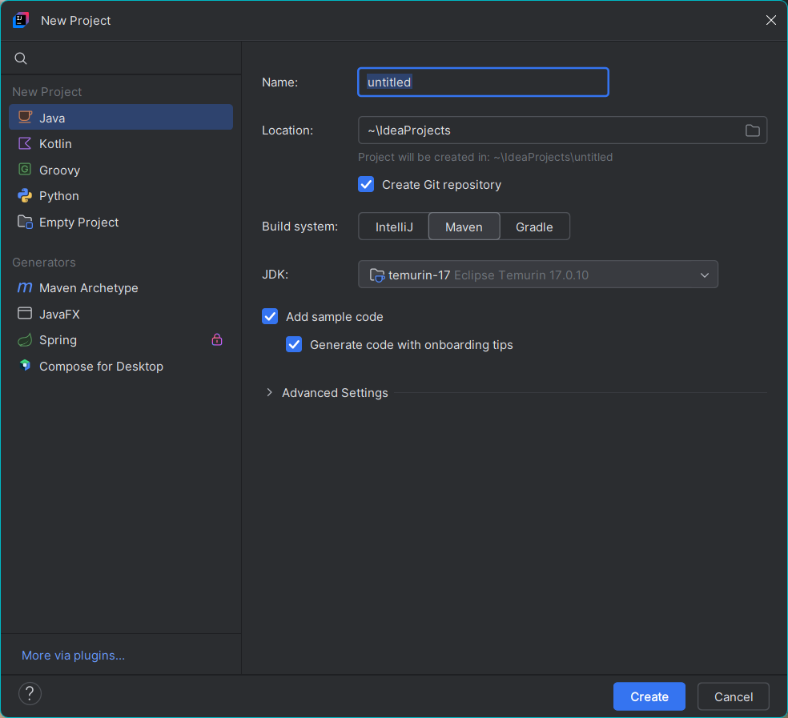
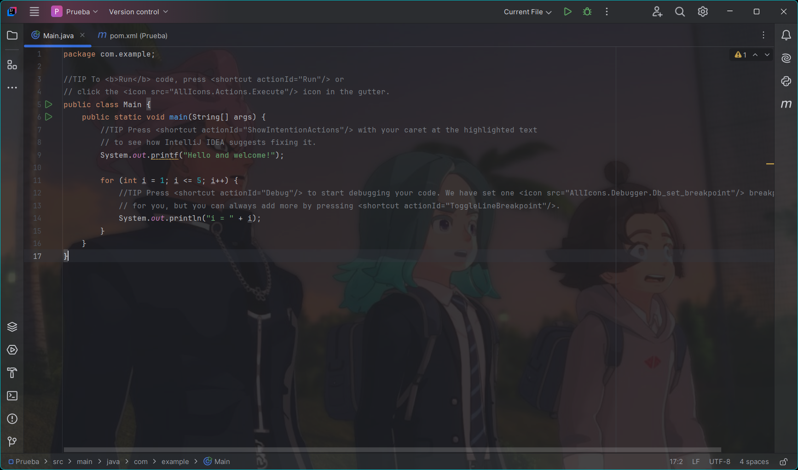

# Tabla de contenido
1. [Indormacion sobre el repos](#Informacion-sobre-el-repositorio)
2. [Estrucra del repositorio](#estructura-del-repositorio)
3. [Carpeta Principal](#carpeta-principal)
4. [Carpeta PDF](#carpeta-pdf)
5. [Repositorio de GitHub (Version Intellij IDEA)](#repositorio-github-version-intellij-idea)

# Informacion sobre el repositorio
- En PSP usaremos: _https://www.jetbrains.com/es-es/idea/download/?section=windows_ Community ZIP

# Estructura del repositorio
Va a estar estructurado en dos carpetas: la principal y la PDF.

## Carpeta principal
En la carpeta principal, tendre todo los cosos de clase. (_que buena explicacion Neo_)

## Carpeta PDF
En esta segunda carpeta estara lo que viene siendo la documentacion que nos facilitaran en clase.

# Usar Intellij IDEA
El zip que nos proporcionaron (que se encuentra en este projecto con el nombre: **"_ideaIC-2024.2.1.win.zip_"**).
 
Cuando se descomprima la carpeta; dentro de dicha carpeta deberas de ir a la carpeta **BIN > idea64.exe** y con eso ya puedes usar este IDE.
 
El entorno de desarrollo nada más abrirse, se mostrara asi:
<!-- 

 -->

 

Con **_New Project_** se crea un nuevo proyecto (_no seas tan obvio Neo :v_).
 

  Le cambiamos el nombre por el nombre del proyecto, si queremos cambiar la localizacion del proyecto le daremos a la carpeta donde se puede selecionar la nueva carpeta de guardado.   El _Build System_, aquí puedes elegir el sistema de construcción que quieres usar para el proyecto.  
Hay tres opciones:
<ul>
<li>
IntelliJ: Usa el sistema de construcción predeterminado de IntelliJ.
</li>
<li>
Maven: Es una herramienta popular para la gestión de proyectos y la automatización de construcción, comúnmente usada en proyectos Java.
</li>
<li>
Gradle: Otra herramienta de construcción que es muy flexible y poderosa, usada en proyectos Java y Android.
</li>
</ul>

Cuando el editor acabe de crearse:
 

 

---

 

# Repositorio GitHub (Version Intellij IDEA)
