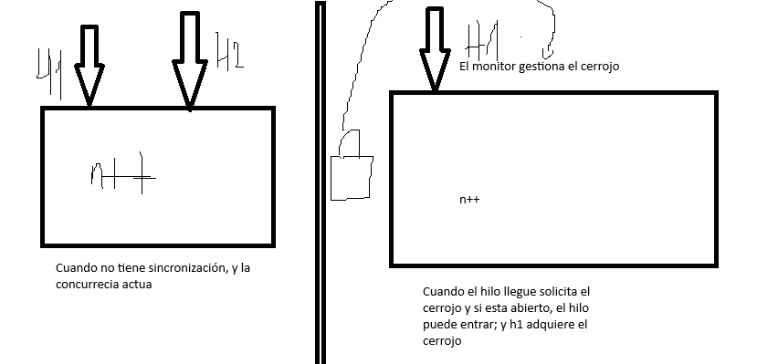

uno de los problemas que surge, cuando varios hilos copiten por un recurso.
Se produce el llamado "condicion de carrera" (race condition).
aquel lugar del codigo se llama seccion critica donde se crea el fenomeno anteriormente menciondo.

Ejemplo:
``
public void inc() {
 n++;
 }
``

hay dos formas para esto:
- Synchronized
-
Dentro de la seccion critica ya no va a ver concurrecia, entonces hay que ver como se limita.
Cuando se usa en metodo de instancia, synchronizes se usa this; el monitor puede ser cualquiercosa.
Si fuera estatico seria el nombre de la clase seguido de '.class'

Aparte de que hay muchas formas:

``
public void inc(){
synchronized([aqui va el moniotr]){
n++
}
}
``

Se puede crear un monitor externo, la cuestion es que no cambie este monitor, sino se pueden tener problemas. ⚠️

``
private static Object m = new Object();
``


# Exclusion mutua



>[!NOTE]
> en el segundo ejemplo H2 permanece en estado de bloqueo, hasta que H1 acabe.
> Después de que salga compiten por el cerrojo. 

>[!WARNING]
> No hacer esto nunca :)

Es poner un Integer como un monitor

``
private Integer n;
public void inc(){
synchronized(n){
n++
}
}
``


Los problemas son:
1. Usar un objeto Integer como monitor no es una buena práctica. Los objetos Integer son inmutables, lo que significa que cada vez que incrementas n, se crea un nuevo objeto Integer.
2. Esto puede llevar a condiciones de carrera, ya que diferentes hilos podrían estar sincronizando en diferentes objetos Integer.
3. Es más eficiente y seguro usar un tipo primitivo int en lugar de Integer para este propósito.

# Metodo Get del ejmplo 9
En este caso, el método get() no está sincronizado, lo que significa que no es una sección crítica en sí mismo. Sin embargo, esto puede llevar a problemas de concurrencia si se accede al valor de 'n' mientras otro hilo está modificándolo en el método inc().

Para hacer que get() sea thread-safe y parte de la sección crítica, podrías sincronizarlo así:

```java
public synchronized int get() {
    return n;
}
```

O usando un bloque sincronizado:

```java
public int get() {
    synchronized (Contador.class) {
        return n;
    }
}
```

Esto aseguraría que la lectura de 'n' sea atómica y consistente con las modificaciones realizadas en inc(). Sin embargo, ten en cuenta que sincronizar get() puede afectar el rendimiento si se llama con frecuencia.

