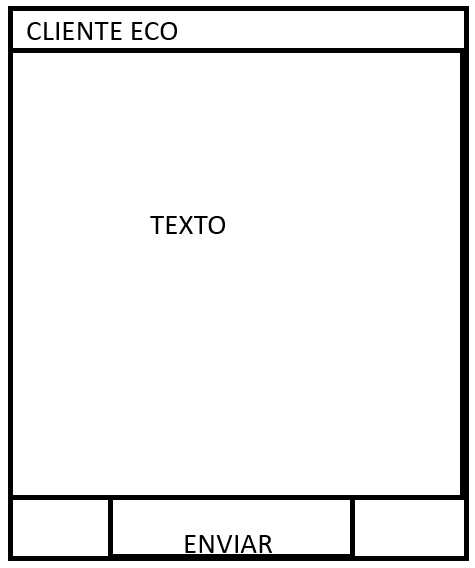

# Cliente con Swing (AMPLIACION)
En este paquete se encontraran las siguentes carpetas:
- V1_ServertextandClienteText
- V2_ClienteText

> [!IMPORTANT]
> La diferencia entre las dos versiones que la V1 tiene un texto extra para poner las notificaciones del Servidor, mientras que en la V2 es como se especifico en clase.

## Enunciado del ejercicio
Este ejercicio es una ampliacion del ejercicio de Servidor Eco.

*Ejercico: ServidorEco*
 
Desarrolla con Java un sistema cliente/servidor en el que el servidor lea secuencias de caracteres enviadas por el cliente y se las reenvíe inmediatamente de vuelta.  Ambas aplicaciones usarán la consola como dispositivo estándar de E/S

 

*Ejercicio de ampliacion*

 

- Clases que hay que crear seran las siguiente:
    - Cliente
    - Servidor
    - ResqueTask

 

*Instrucciones*

El cliente a de ser desarrollado usando Swing (*interfaz grafica*).

 
En el cliente se mostran los mensajes que llegan al servidor, como en el ejercicio base de este. 
Cualquier error que ocurra en la clase de ResqueTask se mostrara en el cliente mostrando algo asi como: "Error: [loquesea]", y se procedera a cerrar el socket.
