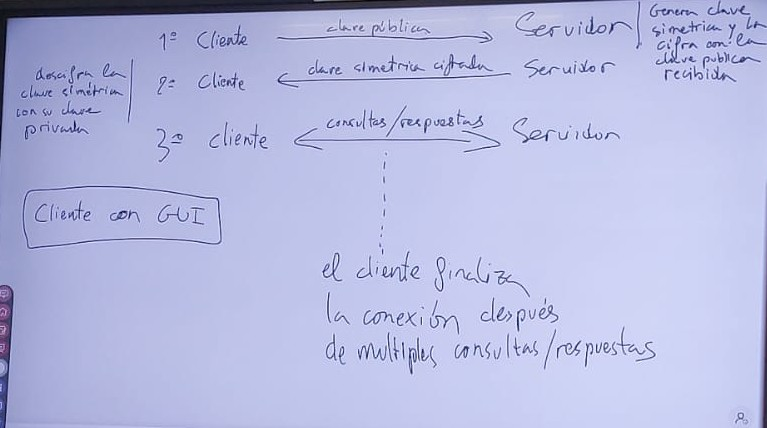

# Instrucciones

Crear un servidor - cliente a partir del ejercicio seis de la unidad 3.

# Ejercicio 6
Crea un servidor que resuelva de forma concurrente peticiones de clientes para el manejo de una lista de contactos telefónicos, teniendo en cuenta que cada contacto puede tener varios teléfonos. 
No se pondrá límite al número de contactos que se pueden almacenar en el servidor ni a la cantidad de teléfonos que puede tener un contacto, salvo el que impone el tamaño de la memoria disponible. 
Los clientes realizarán una petición por conexión en formato de texto, atendiendo a la sintaxis que se describe a continuación: 
Añadir un contacto: 
nombre: teléfono 
• El dato teléfono estará formado únicamente por dígitos decimales. 
• Si se especifica un nombre nuevo, se crea un nuevo contacto con el teléfono especificado. 
• Si el contacto ya existe, se le añade el teléfono especificado. 
• El servidor retornará al cliente una línea con el texto “OK” si los datos se añaden 
correctamente. 
• Si el teléfono ya existe para ese contacto, el servidor retornará una línea con el texto 
“ERR01”.
Consultar los teléfonos de un contacto: 
buscar:nombre 
• El servidor retornará una línea con el texto “OK” seguida de los teléfonos del contacto, 
cada uno en una línea de texto. 
• Si el contacto no existe, retornará una línea con el texto “ERR02”. 
Eliminar un contacto a partir de un nombre: 
eliminar:nombre 
• Si el contacto existe, se eliminan sus datos del servidor y éste retornará una línea con el 
texto “OK”. 
• Si el contacto no existe, retornará una línea con el texto “ERR02”. 
Mostrar todos los contactos: 
contactos 
• El servidor retornará una línea con el texto “OK” seguida de un listado con todos los 
contactos, cada uno en una línea de texto, en orden alfabético. 
Si el servidor detecta un error de sintaxis en la petición, retornará al cliente una línea con el texto 
“ERR03”, seguida de una línea con el texto de la petición, seguida de una línea que incluya el 
carácter ‘^’ marcando la posición del error. 

# Añadidos

El cliente se realizara con un GUI (el cual hay que inventarselo)

- Generar clave simetrica y cifrar la clave publica para recibirla

1- Cliente -- Clave Pub --> Servidor
2- Cliente <-- Clave simetrica cifrada -- Servidor
3- Cliente <-- Consultas / respuestas  --> Servidor

Desde el tres cifrada con la clave simetrica
El cliente finaliza la conexion despues de multiples consultas / respuestas.

----

