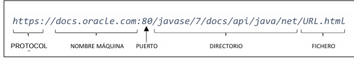

# Clases de programacion de comunicacion.

Hay tres niveles de comunicacion para dentificar el destino y el origen:
- mac
- ip
- nº puerto (socke)

En estos ej tenemos que fijarnos en la Ip = Nombre del Host || Se usa el protocolo de DNS.

# Clase InetAdress
Te da info de lo que sea.

## Características Principales

- Representa una dirección IP y un nombre de host
- Proporciona métodos para resolver nombres de host a direcciones IP
- Permite validar y manipular direcciones IP
- No tiene constructor público (se usan métodos factory)


## Métodos Importantes

```java
// Obtener dirección IP local
InetAddress direccionLocal = InetAddress.getLocalHost();

// Obtener dirección IP por nombre de host
InetAddress googleIP = InetAddress.getByName("www.google.com");

// Obtener todas las direcciones IP asociadas a un host
InetAddress[] todasLasIP = InetAddress.getAllByName("www.google.com");

// Verificar si un host está alcanzable
boolean alcanzable = googleIP.isReachable(5000); // timeout 5 segundos
```


## Métodos Adicionales

- **getHostName()**: Devuelve el nombre del host
- **getHostAddress()**: Devuelve la dirección IP en formato String
- **getAddress()**: Devuelve la dirección IP como array de bytes
- **isReachable()**: Comprueba si el host es alcanzable

# Clase URL
Represneta un puntero a un recurso en la Web.



## Características Principales

- Representa una URL completa con todos sus componentes
- Permite acceder a recursos web mediante diferentes protocolos
- Proporciona métodos para analizar y manipular URLs
- Facilita la conexión y descarga de recursos


## Métodos Importantes

```java
// Crear una URL
URL url = new URL("https://www.ejemplo.com/pagina.html");

// Obtener componentes de la URL
String protocolo = url.getProtocol();    // "https"
String host = url.getHost();             // "www.ejemplo.com"
String ruta = url.getPath();             // "/pagina.html"
int puerto = url.getPort();              // -1 (puerto por defecto)

// Abrir conexión y leer contenido
URLConnection conexion = url.openConnection();
InputStream input = conexion.getInputStream();
```
## Métodos Adicionales

- **getFile()**: Obtiene el nombre del archivo de la URL
- **getQuery()**: Obtiene la parte de consulta de la URL
- **getRef()**: Obtiene el fragmento de referencia
- **toURI()**: Convierte la URL a un objeto URI


