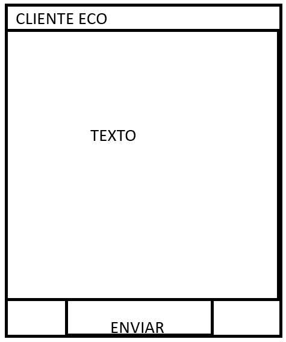

Cliente con Swing

Ampliacion del ej, 
cualquier error que del reqtask enviar al cliente el mensaje de error
Error: [loquesea]

System.out.println("> ERRROR " + e.getMessage());
Y se cierra socket

cualquier error que se lance a la peticion se lanza el mensjae de error

Clases a tener en cuenta:
-Cliente, Servidor, ResqueTask

Servidor de contactos

