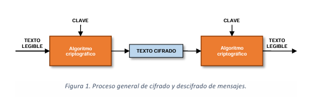
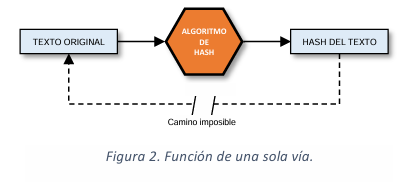
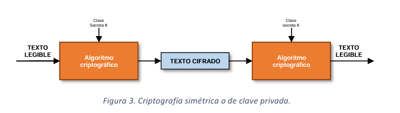
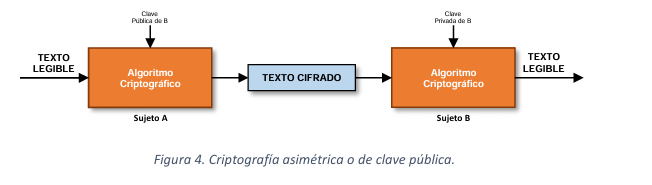

# Día  27/01/2025 - PSP 

## Tabla de contenidos
1. [Criptografía](#criptografía)
2. [Criptografía Funciones hash](#criptografía--funciones-hash-)
    - [Características Principales](#características-principales)
    - [Algoritmos Comunes](#algoritmos-comunes)
3. [Criptografía Simétrica: Conceptos Fundamentales](#criptografía-simétrica-conceptos-fundamentales)
    - [Características Principales](#características-principales-1)
    - [Algoritmos Comunes](#algoritmos-comunes-1)
4. [Criptografía Asimétrica: Conceptos Fundamentales](#criptografía-asimétrica-conceptos-fundamentales)
    - [Características Principales](#características-principales-2)
    - [Algoritmos Comunes](#algoritmos-comunes-2)
---
 

# Criptografía

Se supone que es cualquier cosa, sobre todo se habla de texto. 

Proceso general:

# Criptografía  Funciones hash 
Las funciones hash son algoritmos que transforman datos de entrada de cualquier longitud en una cadena de salida de longitud fija, llamada "**_hash_**" o "**_resumen_**".

### Características Principales

- Unidireccionalidad: Es computacionalmente imposible obtener el dato original a partir del hash
- Determinismo: El mismo dato de entrada siempre produce el mismo hash de salida
- Efecto avalancha: Un pequeño cambio en la entrada produce un hash completamente diferente
- Resistencia a colisiones: Es extremadamente difícil encontrar dos entradas diferentes que produzcan el mismo hash

### Algoritmos Comunes

- MD5 (obsoleto para uso criptográfico)
- SHA-1 (considerado inseguro para nuevas aplicaciones)
- SHA-256 y SHA-512 (recomendados actualmente)
- BLAKE2 y BLAKE3 (algoritmos modernos de alto rendimiento)

## Criptografía Simétrica: Conceptos Fundamentales

La criptografía simétrica es un método de cifrado que utiliza la misma clave para cifrar y descifrar datos.

### Características Principales

- Usa una única clave compartida entre emisor y receptor
- Mayor velocidad de procesamiento que la criptografía asimétrica
- Ideal para cifrar grandes volúmenes de datos
- Requiere un canal seguro para compartir la clave

### Algoritmos Comunes

- AES (Advanced Encryption Standard)
    - Tamaños de clave: 128, 192 y 256 bits
    - Estándar actual más utilizado
- DES (Data Encryption Standard)
    - Considerado obsoleto
    - Reemplazado por Triple DES y AES

## Criptografía Asimétrica: Conceptos Fundamentales

La criptografía asimétrica, también conocida como criptografía de clave pública, utiliza un par de claves diferentes: una pública y una privada.

### Características Principales

- Par de claves matemáticamente relacionadas
- La clave pública puede ser compartida libremente
- La clave privada debe mantenerse en secreto
- Lo que se cifra con una clave solo se puede descifrar con la otra

### Algoritmos Comunes

- RSA
    - El más utilizado en la actualidad
    - Basado en la factorización de números primos grandes
- ECC (Criptografía de Curva Elíptica)
    - Más eficiente que RSA
    - Requiere claves más cortas para el mismo nivel de seguridad

