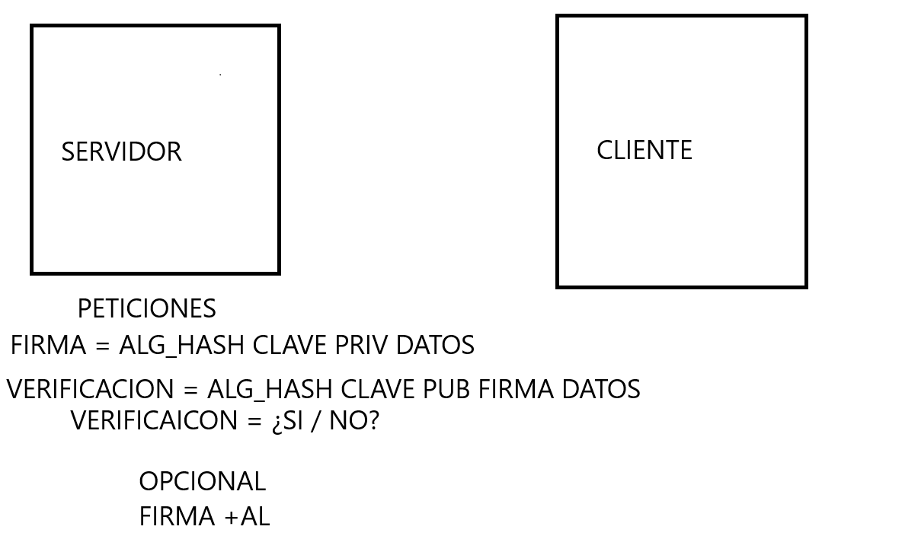

Generar las claves privadas y publicas en el servidor, las peticiones seria verificar y firmar.

Tema verificacion si o no confirmacion
opcional pasarle el algoritmo a la firma
(todo muy raro explicado jaja)