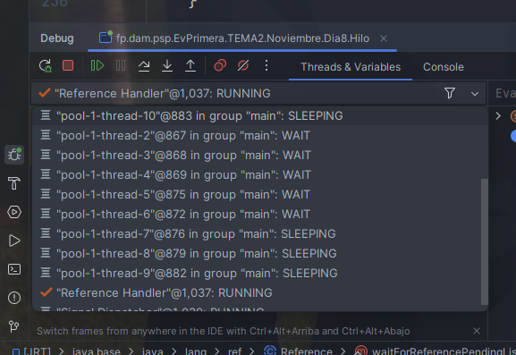

# Executor

Es una intefaz parte del framework de concurrencia de Java y proporciona una forma de desacoplar la ejecución de tareas de la mecánica de creación y gestión de hilos. 
- Simplifica la gestión de hilos en aplicaciones concurrentes.
- Permite ejecutar tareas asíncronas sin manejar directamente los hilos.
- Ofrece diferentes implementaciones para diversos escenarios de concurrencia.
- Mejora el rendimiento al reutilizar hilos en un pool, reduciendo la sobrecarga de creación de hilos.
 
 
El uso de Executor es una práctica recomendada en Java moderno para manejar tareas concurrentes de manera eficiente y escalable.
 
 

- Solo cuando se pausa esta madre se ven los hilos