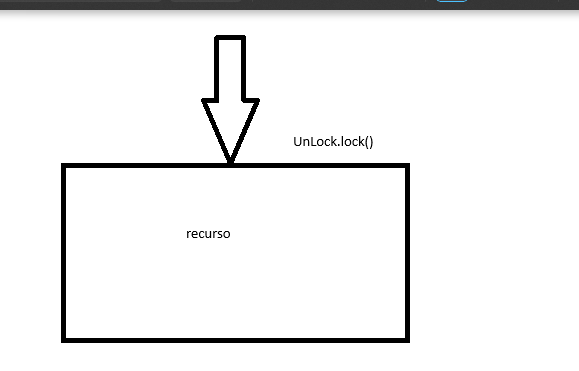
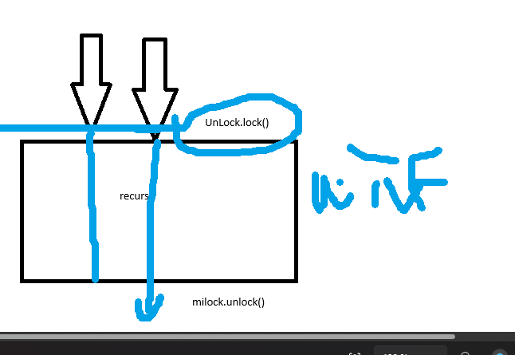

# LOCK ~~(no blue Lock)~~
Bloqueos para acceder a bloques compartidos.
Con estos cosas son sencillitas, supuestamente.

Si deja entrar pilla el bloqueo, de tal manera que ya puede aceder, los otros no accederan hasta que el hilo salga con unlock

Con ReentrantLock lo implementa