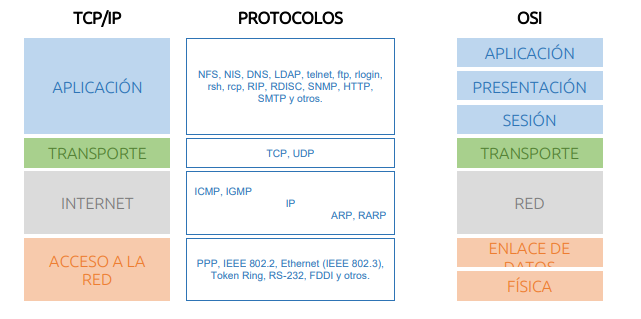

# TEMA 3: Direccionamiento de las IP

## Arquitectura TPC/IP

Definicion de la arquitectura dentro del ordenador, hecha por capas. 
(Es un puto rollo)

Interres de esta mierda es los protocolos.

### PROTOCOLOS
HTTP / Apache = 80 

